# Fortrace-Scenario2-Usage

# ForTrace++ Installation Guide

This guide provides instructions for installing and setting up ForTrace++, a framework for semi-automatic generation of holistic digital forensic datasets. The following instructions are specifically tailored for Windows 10/11 systems using Windows Subsystem for Linux (WSL) but can also be applied to Linux systems.

## Prerequisites

Since ForTrace++ runs graphical applications, WSL2 is mandatory for Windows. As of writing, WSL2 is the default for all new installations.

## WSL Installation(Skippable if OS is not Windows)

1. Open Windows Terminal as Administrator and run:
```powershell
wsl --install
```

2. Open a normal PowerShell window and set WSL2 as your default WSL version (no administrative privileges required as this is a per-user setting):
```powershell
wsl --set-default-version 2
```

3. To see available Linux distributions for download through the online store, use:
```powershell
wsl --list --online
```

4. Install your preferred distribution (example using Ubuntu 24.04):
```powershell
wsl --install -d Ubuntu-24.04
```

## System Setup

1. Start WSL and update the system:
```bash
sudo apt update
sudo apt full-upgrade -y
```

2. Exit and restart WSL to apply updates.

## ForTrace Installation

This ForTrace installation guide utilizes PyCharm, as this IDE offers a particularly user-friendly setup process.
While Dennis W0lf describes alternative installation methods(here: https://gitlab.com/DW0lf/fortrace/-/tree/main), such as for Visual Studio Code, PyCharm is recommended here due to its intuitive interface and simplified configuration.

1. Clone the repository:
```bash
git clone https://gitlab.com/DW0lf/fortrace.git
```

2. Create and activate a new virtual environment in the project's root folder:
```bash
python -m venv .venv
source .venv/bin/activate
```

3. Determine your Python version and install requirements:
```bash
FILE_SUFFIX=$(python --version | grep -oP '(?<=Python )\d+\.\d+' | sed 's/\./_/g')
pip install -r requirements_lock_$FILE_SUFFIX.txt
```

## Installing libguestfs

Due to licensing restrictions, Python bindings for libguestfs must be installed manually. Visit the [project homepage](https://libguestfs.org/guestfs-python.3.html) for detailed information.

Install the package using:
```bash
pip install http://libguestfs.org/download/python/guestfs-1.40.2.tar.gz
```
Note: Replace the version number (1.40.2) with your desired version.

## Required System Packages

Install the following system packages:

```bash
sudo apt install qemu-kvm libvirt-daemon-system libvirt-dev python3 python3-dev build-essential
sudo adduser $USER libvirt
sudo apt install virt-manager
sudo apt install tesseract-ocr tesseract-ocr-eng wireshark-common libguestfs-tools libguestfs-dev
sudo apt install snapd
sudo snap install pycharm-community --classic
sudo usermod -aG wireshark $USER
sudo setcap cap_net_raw,cap_net_admin=eip /usr/bin/dumpcap
```

## Starting the Environment

1. Launch the required applications:
```bash
pycharm-community
virt-manager
```

## PyCharm Configuration

1. Navigate to your cloned ForTrace installation
2. Right-click on the src-directory and select "Mark Directory as" → "Sources Root"

[Pycharm Config: Set source](images/Installation/Installation-src.png)

Note: If you encounter "files not found" errors, try marking the entire fortrace directory as sources root.


The preceding section detailed the complete setup process for Fortrace++, encompassing both the installation of required dependencies and PyCharm configuration. 
The following section will guide you through setting up the Virtual Machine environment using virt-manager.

## Virtual Machine Setup

### Creating a Windows 10 VM

1. Download the Windows 10 ISO from [Microsoft's official website](https://www.microsoft.com/en-us/software-download/windows10). Any Windows 10 version is compatible, but ensure you select 'English International' or 'English (United States)' as ForTrace++ requires an English OS.

2. Open Virtual Machine Manager and follow these steps:
   - Click 'Create a new virtual machine'
   - Select 'Local install media (ISO image or CDROM)' and click Forward (NOTE: If it doesn't automatically detect your operating system (iso), untick "Automatically detect from the installation media / source, type win into the search bar and choose "Microsoft Windows 10 (win10)" )
   - Browse to your Windows 10 ISO (the system should automatically detect the OS type)
   - Configure the VM resources:
     - Memory: 8192 MB (recommended)
     - CPU: 6 cores (recommended)
   - Create a disk image with at least 40GB
   - Name your VM (default: 'win10') and ensure the 'default' network is selected


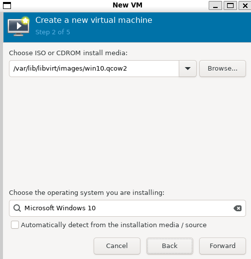
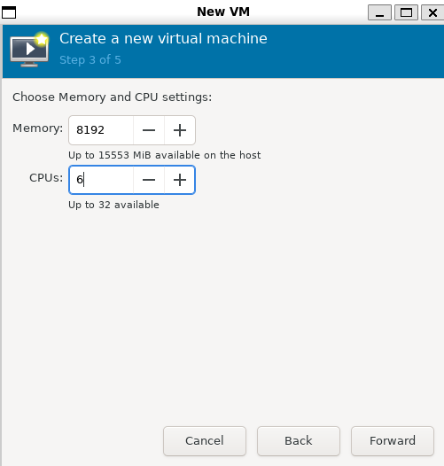
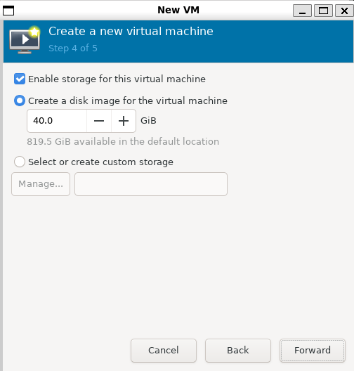
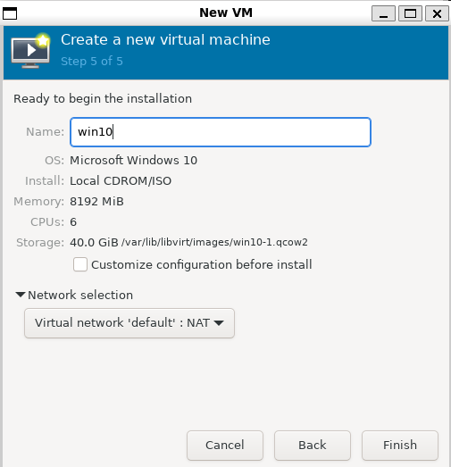


NOTE: You might have to convert the .iso into a .qcow2 image using this command:
```bash
    sudo qemu-img convert -O raw /var/lib/libvirt/images/win10.qcow2 /path/to/win10.img
```

### Windows Installation and Configuration

1. Complete the initial Windows setup:
   - For 'Language to install' and 'Time and currency format': Keep defaults
   - Set 'Keyboard or input method' to US
   - When prompted for product key, select 'I don't have a product key'
   - Choose 'Windows 10 Home' edition
   - Select 'United States' for region and 'US' for keyboard layout

2. Create a local account:
   - Username: fortrace
   - Password: fortrace
   
   > **Note**: You can use different credentials but remember to update them in the configuration files for Scenario 1 and Scenario 2.

3. Local Account Creation for Windows 10 22H2 and later:
   > **Important**: Recent Windows versions require Microsoft account login by default. To create a local account:
   1. Disable network connection:
      - Click 'Show Virtual hardware details' in virt-manager
      - Locate NIC settings
      - Deactivate Link state
   2. Enter any Microsoft account credentials when prompted
   3. When connection fails, you'll be allowed to create a local account
   4. Make sure to re-activate your Link state afterwards

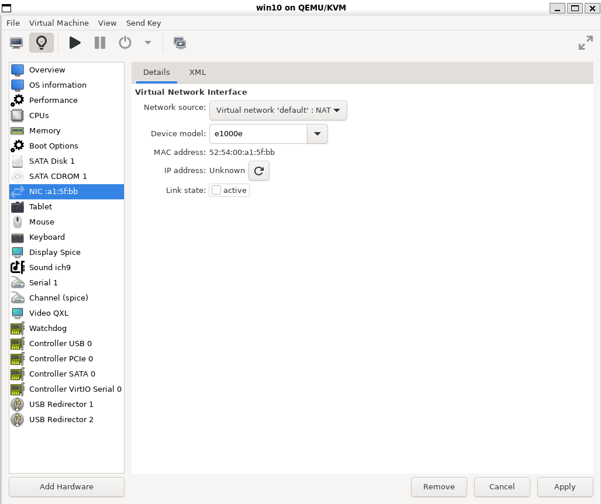

4. Complete the setup:
   - Answer security questions (any answers are fine)
   - Adjust privacy settings as preferred
   - Skip 'customise experience'
   - Select 'Not now' for Cortana
   - Complete Microsoft Edge setup (signing in is optional)

### Required Software and System Configuration

1. Install VeraCrypt:
   - Download and install VeraCrypt 1.26.7 (latest stable release from October 2023)
   - Skip the tutorial at the end of installation

2. Disable mouse acceleration:
   ```
   1. Press Windows+R
   2. Enter 'main.cpl'
   3. Go to 'Pointer Options'
   4. Uncheck 'Enhance pointer precision'
   ```

3. Configure network settings:
   - Open Settings → Network & Internet
   - Open Properties of the active Ethernet connection
   - Set Network Profile to Private

4. Disable notifications:
   - Open Settings → System → Notifications & actions
   - Disable 'Get notifications from apps and other senders'
   - Disable all notification checkboxes

5. Disable SecureBootEncodeUEFI:
   - Open Task Scheduler
   - Navigate to 'Task Scheduler Library\Microsoft\Windows\PI'
   - Select 'SecureBootEncodeUEFI' and click 'Disable'

6. Update Windows:
   - Open Settings → Update & Security
   - Install all Windows Updates
   - Restart when prompted

### Creating a Snapshot

1. Power off the VM
2. Click 'Manage VM snapshots'
3. Create a new snapshot named 'veracrypt'

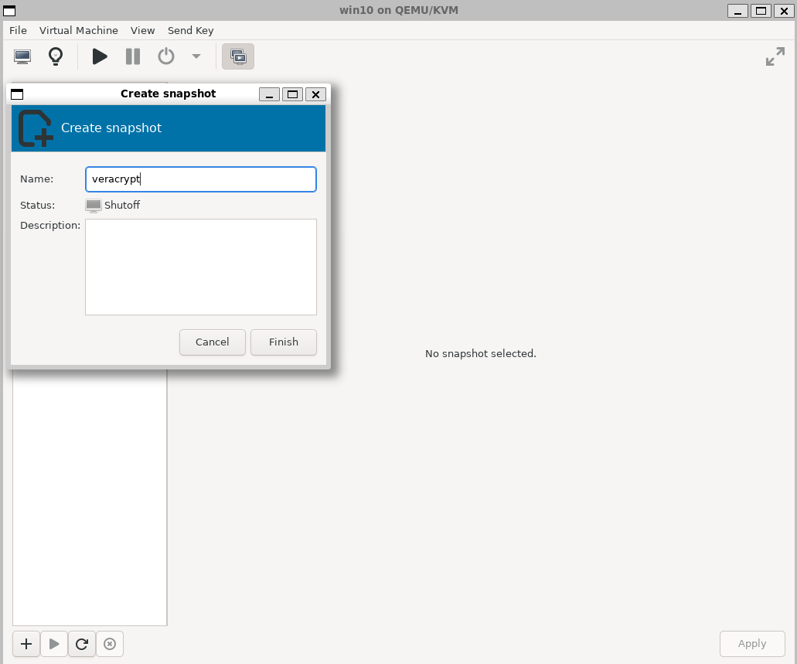

> **Note**: Both the VM name and snapshot name are crucial for scenario execution.


This section provides comprehensive guidance on the Virtual Machine installation process - from initial setup through to completion. 
With all installation steps completed, the environment is now ready for configuration.
The following section presents a detailed Configuration Tutorial, which will walk through the structure of .yaml files and explain the purpose of each keyword. 
Additionally, it will demonstrate how to create and configure custom scenarios.

# Scenario Configuration Guide

## Location and Structure

The configuration files for scenario 2 are located in the directory `fortrace/examples/Windows/Veracrypt_Edge`. The main entry point is `scenario_2.py`, which uses YAML configuration files (e.g., `scenario_2_level1.yaml`).

## Configuration File Example

Below is an example configuration file with detailed explanations for each section:

```yaml
name: Student Research Scenario
description: Configuration file for the Student Research Scenario
author: Mueller, Pascal
```

### Collections Section
This section defines the data sources for the scenario:
```yaml
collections:
  c-http-0:
    type: http
    urls: "examples/Windows/ForTrace_Workshop/VeraCrypt_Edge/browse1.txt"
  c-http-1:
    type: http
    urls: "examples/Windows/ForTrace_Workshop/VeraCrypt_Edge/download1.txt"
  c-web-search:
    type: http
    terms: "examples/Windows/ForTrace_Workshop/VeraCrypt_Edge/search1.txt"
```
- `c-http-0`: Defines URLs for browsing
- `c-http-1`: Defines URLs for file downloads
- `c-web-search`: Defines search terms for web searches

### Root Configuration
```yaml
root: /var/tmp/ForTrace_scenario_2
overwrite_root: True
```
- `root`: Specifies the base directory for scenario outputs
- `overwrite_root`: If True, overwrites existing data in the root directory

### Domain Configuration
```yaml
domain:
  username: "fortrace"
  password: "fortrace"
  name: "win10"
  network: "default"
  os_type: OSType.WINDOWS
  desktop_env: DesktopEnvironment.Windows_10
  start_sniffer: True
  snapshot: "veracrypt"
  dump_images: True
```
- `username` & `password`: VM login credentials
- `name`: Virtual machine name
- `network`: Network configuration
- `os_type`: Operating system type
- `desktop_env`: Desktop environment specification
- `start_sniffer`: Enables network traffic capture
- `snapshot`: Name of the VM snapshot to use
- `dump_images`: Enables screen capture during execution

### VeraCrypt Configuration
```yaml
veracrypt:
  container_hidden: False
  container_path: 'C:\Users\fortrace\Desktop\container'
  container_history: False
  container_encryption: "AES"
  container_hash: "SHA-512"
  container_size_mb: 512
  container_password: "Very5ecureP*sswordN00neW1llG@t"
  container_filesystem: "FAT"
  mouse_movement_seed: 1234
  mouse_movement_time_s: 5
  container_mount_point: "A"
```
- `container_hidden`: Enables/disables hidden container feature
- `container_path`: Location of the VeraCrypt container
- `container_history`: Enables/disables container access history
- `container_encryption`: Encryption algorithm
- `container_hash`: Hash algorithm
- `container_size_mb`: Container size in megabytes
- `container_password`: Container password
- `container_filesystem`: File system type
- `mouse_movement_seed`: Seed for simulated mouse movements
- `mouse_movement_time_s`: Duration of simulated mouse movements
- `container_mount_point`: Drive letter for mounted container

### Generator Configuration
```yaml
generator:
  action_delta_minimum: 10
  action_delta_maximum: 10
  seed: 1234
  actions:
    web_browsing:
      application: "Microsoft Edge"
      operations:
        - name: "browsing"
          amount: 4
          source: c-http-0
          source_unique: True
          enable_scraping: True
        - name: "download"
          amount: 3
          source: c-http-1
          source_unique: True
        - name: "web_search"
          amount: 3
          source: c-web-search
          source_unique: True
          enable_scraping: False
    file_management:
      application: "File Explorer"
      operations:
        - name: "move"
          amount: 2
          source: web_browsing
          destination: 'A:'
```
- `action_delta_minimum/maximum`: Time range between actions
- `seed`: Random seed for reproducibility
- `actions`: Defines automated actions:
  - `web_browsing`: Configure browser automation
    - `amount`: Number of actions to perform
    - `source`: Data source from collections
    - `source_unique`: Whether to use each item once
    - `enable_scraping`: Enables webpage content capture
  - `file_management`: Configure file operations
    - `move`: Specifies file movement operations


## Reference Files

The scenario uses three text files for automation:

1. `browse1.txt`: Contains URLs for automated browsing
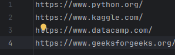

2. `download1.txt`: Contains URLs for file downloads
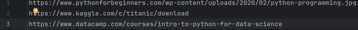

3. `search1.txt`: Contains search terms for Google searches
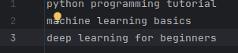

These files should be populated with appropriate URLs and search terms for your specific scenario needs.

Every file (yaml+text files) can be found this repository (in examples).

Run scenario_2.py to start a configurated scenario (NOTE: Make sure to reference your yaml in scenario_2.py).

Feel free to open virt-manager to spectate the Automatism interacting with your VM-Installation, but do NOT interact with the VM yourself.

It will start with creating a VeraCrypt container, then doing all the actions specified in the yaml (browsing, searching, downloading and moving downloaded files into the container).
The container makes sure to only move files, which have been downloaded.

After finishing all the in the yaml specified actions, the automatism will create an .raw image and a pcapng file

- The .raw image has a size of around 40GB. It can be trimmed down to around 10GB by converting it using the FTK-Imager in the next step. The image can be analyzed using forensic tools like Magnet Forensic Axiom, or FTK Imager itself.

- The .pcapng file is the output of the sniffer, it can be analysed using Wireshark

## Example Scenarios

This section presents an overview of custom-developed scenarios, each accompanied by a narrative description, key features, and associated research questions suitable for educational applications. For each scenario, you'll find:

- A brief storyline providing context
- Essential characteristics and components
- Educational research questions to explore

### Scenario 1: CS Student Research
This scenario simulates a Computer Science student searching for AI and Machine Learning resources for a college assignment.

**Key Characteristics:**
- Minimal noise in the generated data
- Limited number of browsed links
- Focused search patterns around academic AI/ML resources
- Basic container usage for storing research materials

**Research Question:**
"Conduct a forensic analysis of the student's research activities by examining:
- Search pattern analysis:
   - Search terms used
   - Temporal sequence of searches
- Web activity investigation:
   - URLs visited
   - Access timestamps
- Container forensics:
   -Container location and creation timestamp
   - Password recovery
   - Content analysis of stored files


Use timeline analysis to reconstruct the sequence of research activities and container usage."

### Scenario 2: Extended Research with Noise
Building upon Scenario 1, this version introduces additional behavioral patterns to create a more realistic user profile.

**Key Characteristics:**
- Increased number of browsed links
- Added diversity through:
  - Political resource access
  - Entertainment platform visits (YouTube, Netflix)
  - Social media interaction
- More varied search patterns
- Random timing between actions

**Research Question:**
"To what extent can behavioral noise (entertainment, social media, political content) mask or alter the detectability of specific research patterns in digital forensic analysis, and how does this impact the reliability of user profiling?(compared to scenario 1)"

### Scenario 3: Bachelor Thesis Research
This scenario simulates a Business Administration student conducting research for a bachelor's thesis.

**Key Characteristics:**
- Most complex scenario with extensive data generation
- Web scraping enabled (`enable_scraping: True`)
- Advanced link exploration:
  - Generator randomly selects 1-5 additional links per source URL
  - Creates realistic browsing patterns
  - Generates supplementary noise in the forensic image
- Comprehensive use of encrypted storage
- Extended session duration
- Multiple file operations

**Research Question:**
"Conduct a content-based forensic analysis focusing on:
- Research topic identification:
   - Main subject areas
   - Sub-topics and related fields
   - Search term patterns and frequencies
- Pattern analysis:
   - Topic clustering
   - Evolution of research focus over time
   - Correlations between searched topics
- Thesis topic determination:
   - Primary research direction
   - Supporting evidence from search patterns
   - Academic resource utilization

Map the findings to establish the overall research context and thesis focus."
"How do complex research behaviors involving web scraping, encrypted storage, and extensive file operations affect the forensic footprint compared to simpler research patterns, and what challenges does this present for forensic investigation methodologies?"

The progression from Scenario 1 to 3 demonstrates increasing complexity in both user behavior simulation and forensic artifact generation. Each scenario can be used to test different aspects of digital forensics tools and methodologies.

## Running the Scenario

Having covered the complete installation and configuration process, this section focuses on the practical implementation of scenarios. 
It details both the execution procedures and explains how to effectively monitor the scenario while it runs.

### Execution
1. Update the YAML file reference in `scenario_2.py` to match your configuration
2. Execute the scenario:
   ```bash
   python scenario_2.py
   ```

### Monitoring
You can observe the automation process through virt-manager as it interacts with your VM. 

> **Important**: Do not interact with the VM during the automation process.

### Process Steps
The automation will:
1. Create a VeraCrypt container
2. Execute actions specified in the YAML:
   - Web browsing
   - Search operations
   - File downloads
   - File transfers to the encrypted container
   
> **Note**: The automation ensures only downloaded files are moved to the container.

The automation also logs its actions:

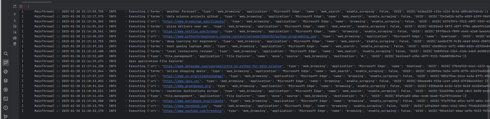

### Generated Artifacts

The process generates two main artifacts for forensic analysis (usually in /var/tmp/"Fortrace Scenario Name"/win10):

#### Raw Image File
- Initial size: ~40GB
- Can be compressed to ~10GB using FTK-Imager
- Analysis options:
  - Magnet Forensic Axiom
  - FTK Imager
  - Other forensic analysis tools

#### Network Capture
- Format: .pcapng
- Contains all network traffic during scenario execution
- Can be analyzed using Wireshark

## Forensic Analysis Guide

This section examines the analysis of artifacts generated during scenario execution. It covers three main aspects:

File Format Conversion:
   - Converting from .raw image format to .e01 format
Digital Forensics Analysis:
   - Detailed examination of the forensic image using Axiom
Network Analysis:
   - Investigation of captured network traffic using Wireshark

Each subsection provides step-by-step guidance for working with and analyzing these forensic artifacts.

### Converting Raw Images
1. Download FTK-Imager from [Exterro's official website](https://www.exterro.com/)
2. Convert the .raw image:
   - Launch FTK Imager
   - Select File → Add Evidence → Image File
   - Select your .raw image as source
   - Right-click the file in the evidence tree
   - Select "Export Disk Image"
   - Choose destination and select E01 as Destination Image Type
   - Optional: Skip Evidence Item Information
   - Optional: Set fragment size (0 for no fragmentation)

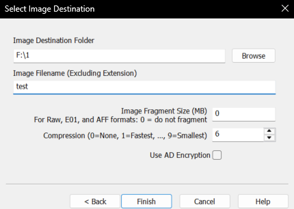

### Analysis with Magnet AXIOM

#### Case Creation
1. Start a new case in AXIOM Process:
   - Enter case number
   - Select case type (e.g., "None" for test cases)
   - Specify locations for case files and acquired evidence


#### Evidence Source Configuration
1. Select source type:
   - Computer → Windows → Load Evidence → Image
   - Select your E01 image
   - Review detected partitions

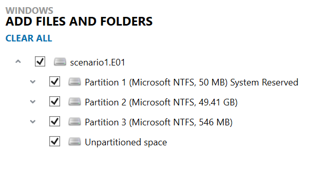

#### Processing Configuration
1. Configure processing details:
   - Keyword searches
   - Optical character recognition
   - Hash calculations
   - Other processing options

2. Select artifact types:
   - Use "Customize Computer Artifacts" to refine selection
   - Choose relevant artifact categories


#### Analysis Results
AXIOM Examine will open automatically after processing. Key findings include:

1. Container Analysis:
   - Encrypted container identified as partition 2
   - Location: Users\fortrace\Desktop\container

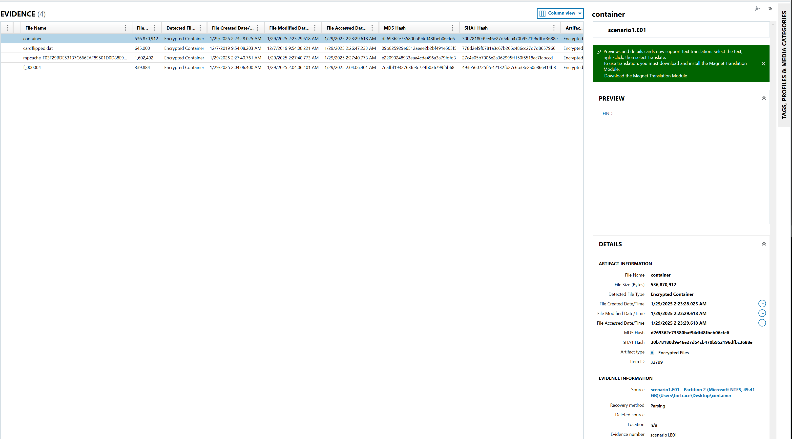

2. Web Activity:
   - Visited websites (e.g., https://www.kaggle.com/c/titanic/download)
   - Search history


3. Timeline Analysis:
   - Application usage (e.g., VeraCrypt usage on 1/29/2025 2:22 AM)
   - System events


4. Security Findings:
   - Exposed credentials (e.g., VeraCrypt password in search bar)
   - Security-relevant events


### Network Traffic Analysis

1. Download [Wireshark](https://www.wireshark.org/) and open the .pcapng file

2. Apply filters for specific analysis:
   - TLS connections to specific domains(examples):
     ```
     tls && (ip.host contains "kaggle" || ssl.handshake.extensions_server_name contains "kaggle")
     ```
   - Data transfers:
     ```
     (ip.host contains "kaggle" || ssl.handshake.extensions_server_name contains "kaggle") && tcp.len > 1000
     ```


3. Analyze specific connections:
   - Right-click on connection of interest
   - Select "Follow TCP Stream"
   - Review detailed connection data

## Support

For additional information about WSL installations, refer to the official documentation for your chosen distribution:
- [Debian Documentation](https://www.debian.org/doc/)
- [Ubuntu Documentation](https://ubuntu.com/tutorials/install-ubuntu-on-wsl2-on-windows-11-with-gui-support)

## Credits

Initial installation based on the guide written by Dennis W0lf: [Dennis W0lf basic installation guide] https://gitlab.com/DW0lf/fortrace/-/tree/main
Ubuntu Installation based on: [Ubuntu Installation] https://documentation.ubuntu.com/wsl/en/latest/howto/install-ubuntu-wsl2/
Configuration of Virt Manager based on his guide found here: [Dennis W0lf VM installation guide] https://gitlab.com/DW0lf/fortrace/-/blob/main/examples/Windows/ForTrace_Workshop/VeraCrypt/readme.md#configuration-of-windows-and-installation-of-necessary-programs
